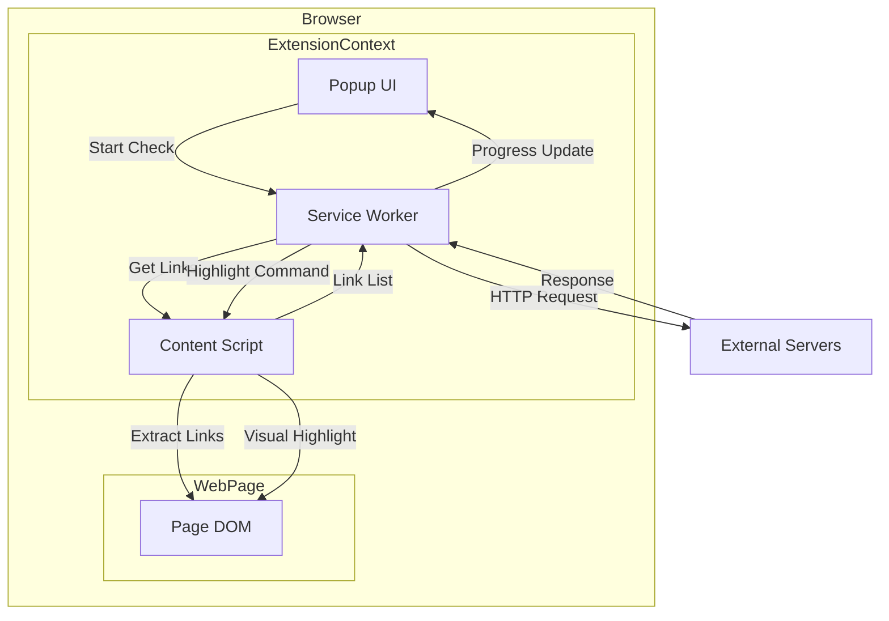
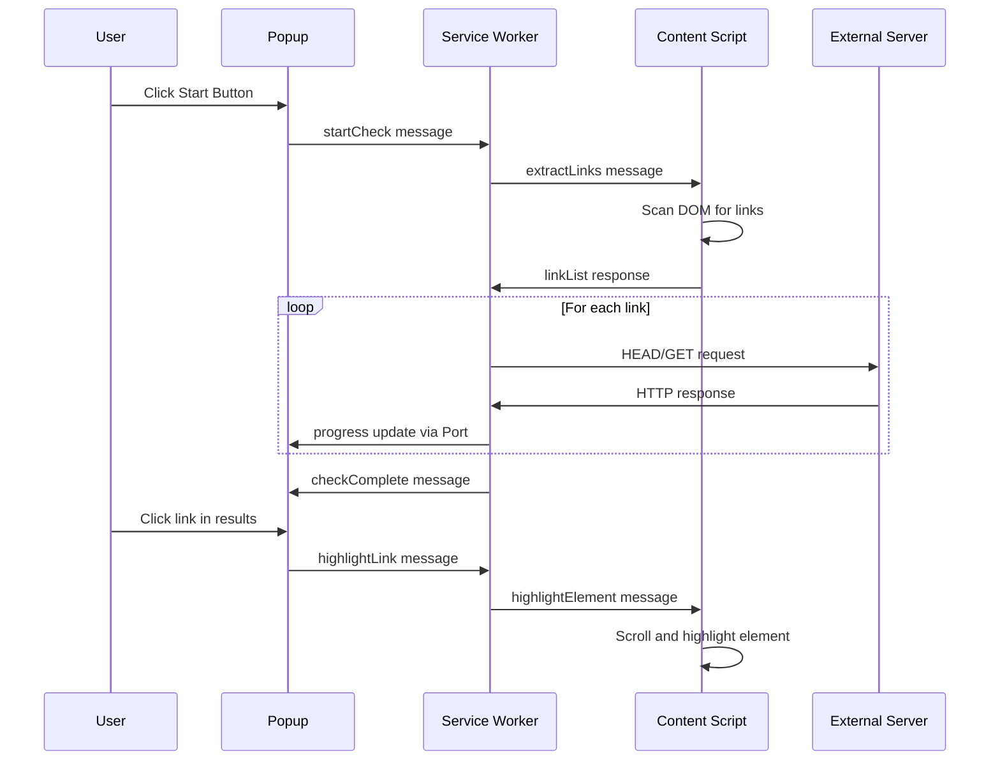
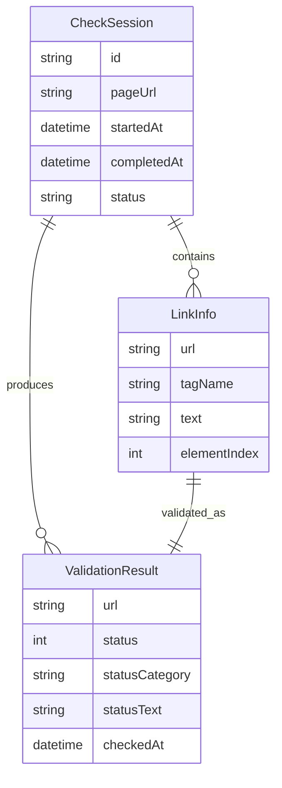

# Design Document

## Overview
**Purpose**: 本拡張機能は、現在閲覧中のWebページ内のリンク切れを検出・報告することで、Webサイト管理者・開発者の品質管理作業を効率化する。

**Users**: Webサイト管理者、フロントエンド開発者、QAエンジニアが、サイトメンテナンスやリリース前の品質チェックに使用する。

**Impact**: ブラウザ拡張機能として動作し、外部ツール不要でリンク検証を完結できる。

### Goals
- ページ内の全リンク要素（a, img, link, script）を自動検出
- HTTPステータスコードによるリンク有効性の判定
- 視覚的にわかりやすい結果表示とフィルタリング
- CSV形式でのエクスポート機能

### Non-Goals
- クロールによる複数ページの一括チェック（単一ページのみ対象）
- リンク先コンテンツの解析（ステータスコードのみ判定）
- 自動修正・置換機能
- 履歴保存・比較機能

## Architecture

### Architecture Pattern & Boundary Map



**Architecture Integration**:
- **Selected pattern**: Message-Driven Architecture（Chrome拡張機能の標準パターン）
- **Domain/feature boundaries**: Popup（UI）、Service Worker（ビジネスロジック）、Content Script（DOM操作）の3層分離
- **Existing patterns preserved**: N/A（新規開発）
- **New components rationale**:
  - Service Worker: CORSバイパス可能なHTTPリクエスト実行、状態管理
  - Content Script: ページ内DOM操作（リンク抽出、ハイライト表示）
  - Popup: ユーザーインターフェース、操作トリガー
- **Steering compliance**: N/A

### Technology Stack

| Layer | Choice / Version | Role in Feature | Notes |
|-------|------------------|-----------------|-------|
| Frontend / CLI | HTML/CSS/TypeScript | Popup UI実装 | バンドラー不使用でシンプル構成 |
| Backend / Services | Chrome Extension Service Worker | HTTP検証、状態管理 | Manifest V3準拠 |
| Data / Storage | chrome.storage.local | 検証結果の一時保存 | Service Worker再起動対応 |
| Messaging / Events | chrome.runtime.connect / sendMessage | コンポーネント間通信 | Port APIで進捗ストリーミング |
| Infrastructure / Runtime | Chrome Browser | 拡張機能ホスト環境 | Manifest V3必須 |

## System Flows

### リンクチェック実行フロー



**Key Decisions**:
- HEADリクエスト優先、失敗時GETフォールバック
- 並列処理数5-10で制限（サーバー負荷軽減）
- Port APIで進捗をリアルタイム通知

## Requirements Traceability

| Requirement | Summary | Components | Interfaces | Flows |
|-------------|---------|------------|------------|-------|
| 1.1-1.4 | リンク要素検出 | LinkExtractor | extractLinks | リンクチェック実行フロー |
| 1.5 | 総数表示 | PopupUI | updateSummary | - |
| 2.1 | HTTP検証実行 | LinkValidator | validateLink | リンクチェック実行フロー |
| 2.2 | ステータス分類 | LinkValidator | classifyStatus | - |
| 2.3 | 進捗表示 | PopupUI, ProgressPort | onProgress | リンクチェック実行フロー |
| 2.4-2.5 | エラーハンドリング | LinkValidator | handleError | - |
| 3.1-3.2 | 結果グループ化 | ResultRenderer | renderResults | - |
| 3.3 | 要素ハイライト | ElementHighlighter | highlightElement | リンクチェック実行フロー |
| 3.4 | リンク情報表示 | ResultRenderer | LinkResultItem | - |
| 3.5 | フィルター | ResultRenderer | filterByStatus | - |
| 4.1-4.5 | ポップアップUI | PopupUI | - | - |
| 5.1-5.2 | 並列/タイムアウト | LinkValidator | RequestConfig | - |
| 5.3-5.4 | キャンセル | LinkValidator | cancelCheck | - |
| 5.5 | バックグラウンド実行 | Service Worker | - | - |
| 6.1-6.3 | CSVエクスポート | CSVExporter | exportToCSV | - |

## Components and Interfaces

| Component | Domain/Layer | Intent | Req Coverage | Key Dependencies | Contracts |
|-----------|--------------|--------|--------------|------------------|-----------|
| PopupUI | UI | ユーザー操作受付と結果表示 | 1.5, 2.3, 3.1-3.5, 4.1-4.5 | Service Worker (P0) | State |
| LinkValidator | Service Worker | リンクのHTTP検証実行 | 2.1-2.5, 5.1-5.4 | fetch API (P0) | Service |
| LinkExtractor | Content Script | DOM内リンク要素抽出 | 1.1-1.4 | DOM API (P0) | Service |
| ElementHighlighter | Content Script | ページ内要素ハイライト | 3.3 | DOM API (P0) | Service |
| ResultRenderer | UI | 検証結果のレンダリング | 3.1-3.5 | PopupUI (P0) | State |
| CSVExporter | Service Worker | CSV形式エクスポート | 6.1-6.3 | chrome.downloads (P1) | Service |
| MessageBus | Shared | コンポーネント間通信 | All | chrome.runtime (P0) | Event |

### Service Worker Layer

#### LinkValidator

| Field | Detail |
|-------|--------|
| Intent | 検出されたリンクに対してHTTPリクエストを送信し、有効性を検証する |
| Requirements | 2.1, 2.2, 2.3, 2.4, 2.5, 5.1, 5.2, 5.3, 5.4 |

**Responsibilities & Constraints**
- HEADリクエストでステータスコード取得、失敗時GETフォールバック
- 並列リクエスト数の制御（デフォルト: 5）
- タイムアウト管理（デフォルト: 10秒）
- AbortControllerによるキャンセル対応

**Dependencies**
- Outbound: fetch API — HTTP検証実行 (P0)
- Outbound: MessageBus — 進捗通知 (P0)
- External: chrome.storage.local — 状態永続化 (P1)

**Contracts**: Service [x] / State [x]

##### Service Interface
```typescript
interface LinkValidatorService {
  validateLinks(links: LinkInfo[]): Promise<ValidationResult[]>;
  cancelValidation(): void;
}

interface LinkInfo {
  url: string;
  tagName: 'A' | 'IMG' | 'LINK' | 'SCRIPT';
  text: string | null;
  elementIndex: number;
}

interface ValidationResult {
  url: string;
  status: number | null;
  statusCategory: 'success' | 'redirect' | 'client_error' | 'server_error' | 'timeout' | 'network_error';
  statusText: string;
  tagName: string;
  text: string | null;
  elementIndex: number;
  checkedAt: string;
}

interface ValidationProgress {
  total: number;
  completed: number;
  current: ValidationResult | null;
}
```
- Preconditions: links配列は空でない
- Postconditions: 全リンクに対する検証結果を返却
- Invariants: 並列リクエスト数はconcurrencyLimit以下

##### State Management
- **State model**: 検証進捗（total, completed, results[], isCancelled）
- **Persistence**: chrome.storage.localに中間結果保存（Service Worker再起動対応）
- **Concurrency strategy**: Promiseベースのセマフォで並列数制御

**Implementation Notes**
- Integration: Service Worker起動時に中断された検証があれば再開
- Validation: URL形式チェック（javascript:, mailto:, data:は除外）
- Risks: 大量リンク時のメモリ消費、一部サーバーのHEAD非対応

---

#### CSVExporter

| Field | Detail |
|-------|--------|
| Intent | 検証結果をCSV形式でダウンロード可能にする |
| Requirements | 6.1, 6.2, 6.3 |

**Responsibilities & Constraints**
- 検証結果をCSV文字列に変換
- BOM付きUTF-8で出力（Excel対応）
- chrome.downloads APIでファイル保存

**Dependencies**
- Inbound: PopupUI — エクスポート要求 (P0)
- External: chrome.downloads — ファイルダウンロード (P0)

**Contracts**: Service [x]

##### Service Interface
```typescript
interface CSVExporterService {
  exportResults(results: ValidationResult[], pageUrl: string): Promise<void>;
}
```
- Preconditions: results配列が存在
- Postconditions: CSVファイルがダウンロードフォルダに保存される

**Implementation Notes**
- Integration: ダウンロードAPIはService Worker内で実行
- Validation: 特殊文字のエスケープ（カンマ、改行、ダブルクォート）

---

### Content Script Layer

#### LinkExtractor

| Field | Detail |
|-------|--------|
| Intent | 現在のページDOMからリンク要素を抽出する |
| Requirements | 1.1, 1.2, 1.3, 1.4 |

**Responsibilities & Constraints**
- a[href], img[src], link[href], script[src]セレクタでDOM検索
- 重複URL除去、相対URLの絶対URL変換
- 無効なURL形式の除外

**Dependencies**
- Inbound: MessageBus — 抽出要求 (P0)
- External: document — DOM API (P0)

**Contracts**: Service [x]

##### Service Interface
```typescript
interface LinkExtractorService {
  extractLinks(): LinkInfo[];
}
```
- Preconditions: ページDOMがロード完了
- Postconditions: ページ内の全リンク情報を返却
- Invariants: 返却されるURLは全て有効な絶対URL

**Implementation Notes**
- Integration: DOMContentLoaded後に実行
- Validation: URL.canParse()で有効性チェック

---

#### ElementHighlighter

| Field | Detail |
|-------|--------|
| Intent | 指定された要素をスクロール表示しハイライトする |
| Requirements | 3.3 |

**Responsibilities & Constraints**
- 要素インデックスで対象を特定
- scrollIntoViewでビューポートに表示
- CSSアニメーションで視覚的フィードバック

**Dependencies**
- Inbound: MessageBus — ハイライト要求 (P0)
- External: document — DOM API (P0)

**Contracts**: Service [x]

##### Service Interface
```typescript
interface ElementHighlighterService {
  highlightElement(elementIndex: number): void;
  clearHighlight(): void;
}
```
- Preconditions: elementIndexが有効範囲内
- Postconditions: 対象要素がハイライト表示される

**Implementation Notes**
- Integration: 既存のハイライトはクリアしてから適用
- Validation: インデックス境界チェック

---

### UI Layer

#### PopupUI

| Field | Detail |
|-------|--------|
| Intent | ユーザー操作の受付と検証結果の表示 |
| Requirements | 1.5, 2.3, 3.1, 3.2, 3.4, 3.5, 4.1, 4.2, 4.3, 4.4, 4.5 |

**Responsibilities & Constraints**
- チェック開始/キャンセルボタン
- 進捗バー表示
- 結果リストのフィルタリング
- 結果クリックでハイライト連携

**Dependencies**
- Outbound: MessageBus — 各種コマンド送信 (P0)
- Outbound: ResultRenderer — 結果描画委譲 (P0)

**Contracts**: State [x]

##### State Management
```typescript
interface PopupState {
  phase: 'idle' | 'checking' | 'completed';
  progress: ValidationProgress | null;
  results: ValidationResult[];
  filter: 'all' | 'success' | 'redirect' | 'error';
  summary: ResultSummary;
}

interface ResultSummary {
  total: number;
  success: number;
  redirect: number;
  error: number;
}
```
- **Persistence**: セッション中のみ（Popup閉じると破棄）
- **Concurrency strategy**: 単一ステート、メッセージ駆動更新

**Implementation Notes**
- Integration: Port接続で進捗受信、閉じた場合は再接続不要（結果はstorageから復元）
- Validation: 状態遷移の整合性チェック

---

### Shared Layer

#### MessageBus

| Field | Detail |
|-------|--------|
| Intent | コンポーネント間のメッセージパッシング抽象化 |
| Requirements | All |

**Responsibilities & Constraints**
- 型安全なメッセージ送受信
- Port接続管理（進捗ストリーミング用）

**Dependencies**
- External: chrome.runtime — メッセージングAPI (P0)

**Contracts**: Event [x]

##### Event Contract
```typescript
type MessageType =
  | { type: 'START_CHECK' }
  | { type: 'CANCEL_CHECK' }
  | { type: 'EXTRACT_LINKS' }
  | { type: 'LINKS_EXTRACTED'; payload: LinkInfo[] }
  | { type: 'VALIDATION_PROGRESS'; payload: ValidationProgress }
  | { type: 'VALIDATION_COMPLETE'; payload: ValidationResult[] }
  | { type: 'HIGHLIGHT_ELEMENT'; payload: { elementIndex: number } }
  | { type: 'EXPORT_CSV' };
```
- Published events: VALIDATION_PROGRESS, VALIDATION_COMPLETE, LINKS_EXTRACTED
- Subscribed events: START_CHECK, CANCEL_CHECK, EXTRACT_LINKS, HIGHLIGHT_ELEMENT, EXPORT_CSV
- Ordering / delivery guarantees: 順序保証あり（Port内）、at-most-once

**Implementation Notes**
- Integration: chrome.runtime.sendMessage（単発）、chrome.runtime.connect（ストリーム）を使い分け

## Data Models

### Domain Model



**Business Rules & Invariants**:
- statusCategoryは statusコードから一意に決定
  - 2xx → success
  - 3xx → redirect
  - 4xx → client_error
  - 5xx → server_error
  - null(timeout) → timeout
  - null(network) → network_error

### Logical Data Model

**Structure Definition**:
- CheckSession: 1回のチェック実行単位
- LinkInfo: ページから抽出されたリンク情報（入力）
- ValidationResult: 検証結果（出力）

**Consistency & Integrity**:
- LinkInfoとValidationResultはelementIndexで対応
- 検証中断時は部分結果を保持

### Data Contracts & Integration

**chrome.storage.local Schema**:
```typescript
interface StorageSchema {
  currentSession: {
    id: string;
    pageUrl: string;
    links: LinkInfo[];
    results: ValidationResult[];
    status: 'checking' | 'completed' | 'cancelled';
    completedCount: number;
  } | null;
}
```

## Error Handling

### Error Strategy
- ネットワークエラーは個別リンクの結果として記録（全体処理は継続）
- Service Worker再起動時は中断地点から再開

### Error Categories and Responses
**User Errors (4xx)**: リンク先が404/403等 → statusCategoryでエラー表示、ユーザーに修正を促す
**System Errors (5xx)**: リンク先サーバーエラー → statusCategoryで表示、一時的な問題の可能性を示唆
**Network Errors**: タイムアウト、接続失敗 → 専用カテゴリで表示、リトライ不要（ユーザー判断）

### Monitoring
- console.errorでエラーログ出力
- 検証失敗数をサマリーに表示

## Testing Strategy

### Unit Tests
- LinkExtractor: 各タグタイプ（a, img, link, script）の抽出
- LinkValidator: ステータスコード分類ロジック
- CSVExporter: 特殊文字エスケープ、BOM付与
- MessageBus: メッセージタイプのシリアライズ/デシリアライズ

### Integration Tests
- Content Script ↔ Service Worker間メッセージング
- 進捗通知のリアルタイム更新
- chrome.storage.localへの永続化/復元

### E2E/UI Tests
- ポップアップからのチェック開始〜完了フロー
- フィルター切り替えによる結果表示
- CSVエクスポートダウンロード

### Performance/Load
- 100+リンクページでの検証時間計測
- 並列リクエスト数の最適値検証
- メモリ使用量モニタリング

## Security Considerations

**Permissions**:
- `host_permissions: ["<all_urls>"]` — 全ドメインへのHEAD/GETリクエストに必要
- `activeTab` — 現在のタブでのContent Script実行
- `storage` — 検証状態の永続化
- `downloads` — CSVエクスポート

**Security Controls**:
- Content ScriptからのURLはService Workerで再検証
- 外部サイトからのスクリプト実行なし（CSP準拠）
- ユーザー入力なし（検証対象はDOM由来）

## Performance & Scalability

**Target Metrics**:
- 100リンクの検証完了: 30秒以内（並列5、タイムアウト10秒想定）
- メモリ使用量: 50MB以下

**Optimization Techniques**:
- HEADリクエスト優先で帯域削減
- 重複URL除去で不要リクエスト削減
- AbortControllerで即時キャンセル

## Supporting References

### Manifest.json Structure
```json
{
  "manifest_version": 3,
  "name": "Link Checker",
  "version": "1.0.0",
  "description": "Check for broken links on the current page",
  "permissions": ["activeTab", "storage", "downloads"],
  "host_permissions": ["<all_urls>"],
  "action": {
    "default_popup": "popup.html",
    "default_icon": {
      "16": "icons/icon16.png",
      "48": "icons/icon48.png",
      "128": "icons/icon128.png"
    }
  },
  "background": {
    "service_worker": "background.js",
    "type": "module"
  },
  "content_scripts": [{
    "matches": ["<all_urls>"],
    "js": ["content.js"]
  }]
}
```
